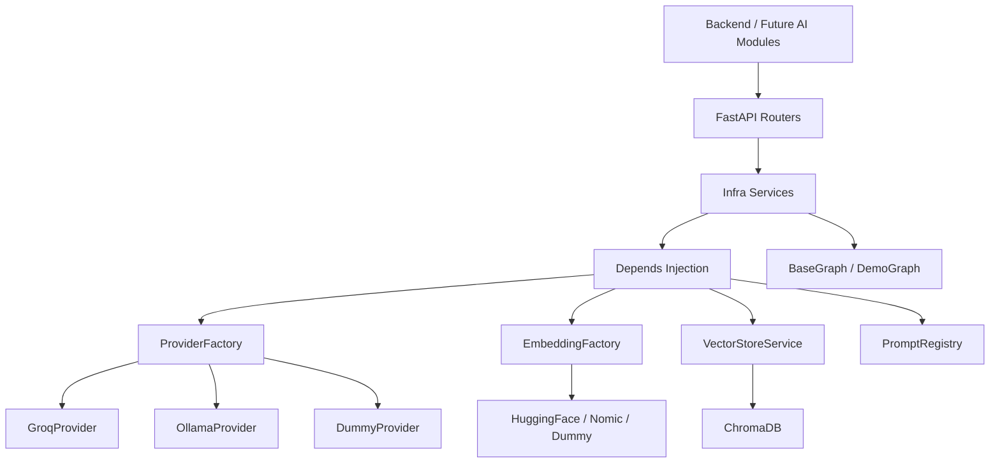
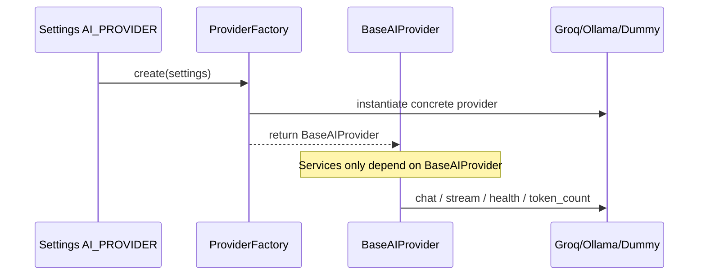
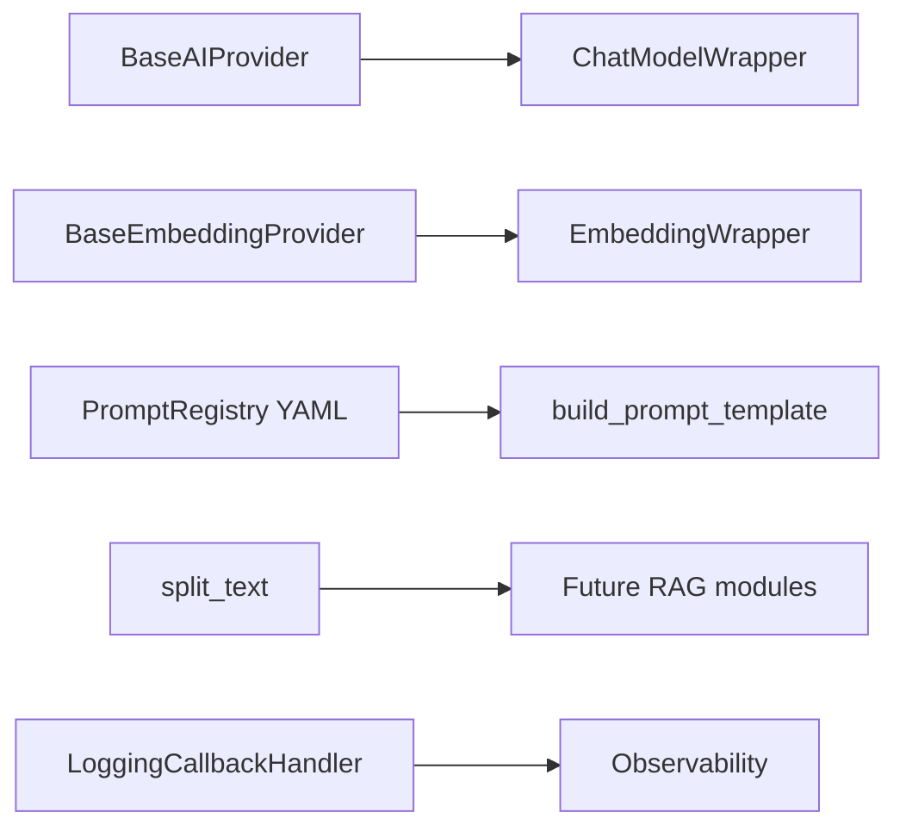
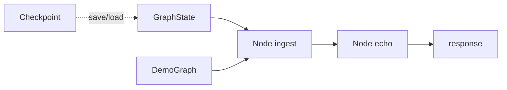
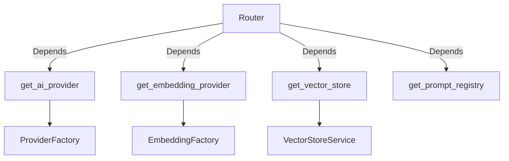

# CodeMentor AI — AI Infrastructure Layer

Reusable AI platform inside `ai-service/`. No product AI features (resume/interview/etc.).

---

## 1. Updated folder tree

```text
ai-service/
├── Dockerfile
├── requirements.txt
├── .env.example
├── data/chroma/
├── tests/
│   └── test_infra.py
└── app/
    ├── main.py
    ├── config/settings.py          # AI_PROVIDER, models, chroma, etc.
    ├── core/
    │   ├── deps.py                 # FastAPI DI
    │   ├── exceptions.py
    │   ├── errors.py
    │   └── logging.py
    ├── providers/
    │   ├── base.py                 # BaseAIProvider
    │   ├── dummy.py
    │   ├── groq.py
    │   ├── ollama.py
    │   └── factory.py
    ├── embeddings/
    ├── vectorstore/service.py
    ├── prompts/registry/ + registry.py
    ├── memory/factory.py
    ├── chains/langchain_infra.py
    ├── agents/graph.py             # BaseGraph + DemoGraph
    ├── pipeline/                   # Reusable AI execution pipeline
    │   ├── executor.py             # AIExecutionPipeline.run / stream
    │   ├── middleware.py           # Pre/post middleware hooks
    │   ├── validators.py
    │   ├── parsers.py
    │   └── types.py
    ├── loaders/
    ├── documents/
    ├── models/
    ├── routers/                    # health, providers, chat, vector, documents, models, config
    ├── services/infra.py
    └── utils/
```

---

## 2. Architecture diagram



---

## 3. Provider flow diagram



---

## 4. LangChain integration diagram



---

## 5. LangGraph integration diagram



---

## 6. Dependency Injection diagram



Services never call `GroqProvider()` / `OllamaProvider()` directly.

---

## 7. Configuration guide

| Variable | Purpose | Example |
|----------|---------|---------|
| `AI_PROVIDER` | Active chat provider | `dummy` / `groq` / `ollama` |
| `GROQ_API_KEY` | Groq auth | from console.groq.com |
| `OLLAMA_BASE_URL` | Local Ollama | `http://localhost:11434` |
| `HF_TOKEN` | HuggingFace hub (optional) | |
| `EMBEDDING_PROVIDER` | Embedding backend | `dummy` / `huggingface` / `nomic` |
| `EMBEDDING_MODEL` | Default BGE small | `BAAI/bge-small-en-v1.5` |
| `CHAT_MODEL` | Model id | `llama-3.1-8b-instant` |
| `TEMPERATURE` / `MAX_TOKENS` / `TOP_P` / `TOP_K` | Generation | |
| `CHROMA_DIRECTORY` | Persist path | `./data/chroma` |

Paste Groq key via `REQUIRED_SECRETS/groq.example` → root `.env`.

---

## 8. How to switch providers

### Dummy (default — works offline)
```env
AI_PROVIDER=dummy
EMBEDDING_PROVIDER=dummy
```

### Groq
```env
AI_PROVIDER=groq
GROQ_API_KEY=gsk_...
CHAT_MODEL=llama-3.1-8b-instant
```

### Ollama
```env
AI_PROVIDER=ollama
OLLAMA_BASE_URL=http://localhost:11434
CHAT_MODEL=llama3.1
```

Restart `ai-service` after changing `.env`. No code changes required.

---

## 9. Future AI module integration guide

1. Add a service under `app/services/` (e.g. `resume_service.py`).
2. Inject `BaseAIProvider`, `PromptRegistry`, `VectorStoreService` via `Depends`.
3. Store prompts as YAML under `app/prompts/registry/` — never hardcode.
4. For multi-step agents, subclass `BaseGraph` in `app/agents/`.
5. **Prefer `AIExecutionPipeline`** for single-turn / chat-style calls:

```text
Request
  → Pre-processing Middleware
  → Validation
  → Prompt Registry
  → Memory
  → Provider
  → Output Parser
  → Post-processing Middleware
  → Telemetry
  → Response
```

Register hooks with `.use_pre(fn)` / `.use_post(fn)` / `.use(middleware)`.
Future modules attach domain logic (PII redaction, schema enrichment) as middleware
instead of forking the pipeline.
6. Expose a thin router; keep business logic in the service.
7. Reuse loaders from `app/loaders/` for documents.
8. Do not instantiate providers inside the new module.

### Pipeline usage

```python
from app.pipeline import AIExecutionPipeline, PipelineRequest

result = await pipeline.run(PipelineRequest(
    message="...",
    system_prompt="system_default",
    memory_kind="window",
    session_id="user-123",
    output_format="text",  # or json | passthrough
))
# result.content / result.parsed / result.meta / result.stages
```

Location: `ai-service/app/pipeline/` (`executor.py`, `validators.py`, `parsers.py`, `types.py`).

---

## API surface (infrastructure)

| Method | Path | Purpose |
|--------|------|---------|
| GET | `/health` | Groq/Ollama/Chroma/Embeddings/version |
| GET | `/providers` | Active + supported providers |
| POST | `/chat` | Infra chat (provider or `use_demo_graph`) |
| POST | `/chat/stream` | SSE stream (`stream_chat` + token events) |
| POST | `/vector` | Convenience search alias |
| GET/POST | `/vector/*` | Collections, search, documents, health |
| GET | `/documents` | Loader catalog |
| POST | `/documents` | Loader preview (no product RAG) |
| GET | `/models` | Configured chat/embedding models |
| GET | `/config` | Non-secret settings dump |

### Telemetry (every AI request)

Responses / SSE `done` events include `requestId`, `provider`, `model`, `latencyMs`, `timestamp`, and `usage` (`promptTokens`, `completionTokens`, `totalTokens`, `estimatedCost`). Structured logs emit the same fields via `app.utils.telemetry`.

Legacy placeholders still return Coming Soon: `POST /interview`, `/resume`, `/code-review`.

---

## Run

```powershell
cd ai-service
python -m venv .venv
.\.venv\Scripts\Activate.ps1
pip install -r requirements.txt
$env:AI_PROVIDER="dummy"
uvicorn app.main:app --reload --port 8000

# Tests
pytest tests/ -q
```

Or: `docker compose up ai-service --build`
