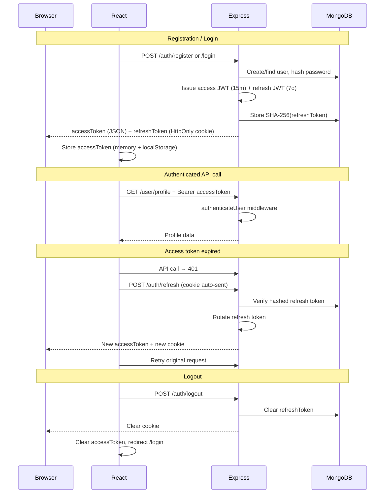

# CodeMentor AI — Authentication

Production-ready JWT authentication with refresh token rotation, HTTP-only cookies, and layered architecture.

---

## Updated folder tree (auth-related)

```text
backend/src/
├── config/
│   ├── env.js              # JWT + cookie settings
│   └── multer.js           # Avatar upload (image MIME validation)
├── controllers/
│   ├── auth.controller.js  # HTTP adapters for auth
│   └── user.controller.js  # HTTP adapters for profile
├── middlewares/
│   ├── auth.middleware.js  # authenticateUser, authorizeRoles
│   ├── rateLimit.middleware.js  # authLimiter (20/15min)
│   └── validate.middleware.js   # Zod error formatting
├── models/
│   └── User.model.js       # User schema
├── routes/
│   ├── auth.routes.js
│   └── user.routes.js
├── services/
│   ├── auth.service.js     # register, login, logout, refresh
│   ├── token.service.js    # JWT sign/verify
│   └── user.service.js     # profile, password, avatar
├── utils/
│   ├── cookie.js           # HTTP-only refresh cookie helpers
│   ├── password.js         # bcrypt hash/compare
│   ├── sanitize.js         # Input sanitization
│   ├── tokenHash.js        # SHA-256 refresh token hashing
│   └── userSerializer.js   # Public user DTO
├── validators/
│   ├── auth.validator.js   # register/login Zod schemas
│   └── user.validator.js   # profile/password schemas
└── scripts/
    └── test-auth.js        # Integration test script

frontend/src/
├── context/AuthContext.jsx
├── hooks/
│   ├── useAuth.js          # login/register/logout mutations
│   └── useProfile.js       # profile query + mutations
├── lib/token.js            # Access token in memory + localStorage
├── pages/
│   ├── LoginPage.jsx
│   ├── RegisterPage.jsx
│   ├── ForgotPasswordPage.jsx  # UI placeholder only
│   ├── ProfilePage.jsx
│   └── SettingsPage.jsx
├── routes/ProtectedRoute.jsx   # ProtectedRoute + GuestRoute
├── services/api.js             # Axios + auto-refresh interceptor
└── utils/
    ├── validation.js           # Client-side password rules
    └── avatar.js               # Avatar URL helper
```

---

## API documentation

Base URL: `/api/v1`

### Auth (public, rate-limited)

#### `POST /auth/register`

**Body:**
```json
{
  "name": "Jane Doe",
  "email": "jane@example.com",
  "password": "SecurePass1!",
  "confirmPassword": "SecurePass1!"
}
```

**Password rules:** min 8 chars, uppercase, lowercase, number, special character.

**Success `201`:**
```json
{
  "success": true,
  "message": "Registration successful",
  "data": {
    "user": { "id": "...", "name": "...", "email": "...", "role": "user", ... },
    "accessToken": "eyJ..."
  }
}
```

Sets `cm_refresh_token` HTTP-only cookie (7 days).

**Errors:** `409` duplicate email, `422` validation failed.

---

#### `POST /auth/login`

**Body:**
```json
{
  "email": "jane@example.com",
  "password": "SecurePass1!"
}
```

**Success `200`:** Same shape as register (user + accessToken + refresh cookie).

**Errors:** `401` invalid credentials.

---

#### `POST /auth/refresh`

No body. Requires `cm_refresh_token` cookie.

**Success `200`:**
```json
{
  "success": true,
  "message": "Token refreshed",
  "data": {
    "user": { ... },
    "accessToken": "eyJ..."
  }
}
```

Rotates refresh token (old token invalidated). Sets new cookie.

**Errors:** `401` missing/invalid/expired/reused token.

---

#### `POST /auth/logout`

Clears refresh token in DB and clears cookie. Works with or without valid access token if refresh cookie is present.

**Success `200`:**
```json
{ "success": true, "message": "Logged out successfully" }
```

---

### User (protected — `Authorization: Bearer <accessToken>`)

#### `GET /user/profile`

**Success `200`:**
```json
{
  "success": true,
  "message": "Profile retrieved",
  "data": { "user": { ... } }
}
```

---

#### `PATCH /user/profile`

**Body:** (at least one field)
```json
{
  "name": "Jane Smith",
  "currentGoal": "Pass system design interviews"
}
```

---

#### `PATCH /user/password`

**Body:**
```json
{
  "currentPassword": "SecurePass1!",
  "newPassword": "NewSecurePass2!",
  "confirmPassword": "NewSecurePass2!"
}
```

Invalidates all refresh tokens (forces re-login).

---

#### `POST /user/avatar`

**Content-Type:** `multipart/form-data`  
**Field:** `avatar` (JPEG, PNG, WebP, GIF — max 5MB)

**Success `200`:**
```json
{
  "success": true,
  "message": "Avatar updated",
  "data": { "user": { "avatar": "/uploads/avatars/..." } }
}
```

---

## Authentication flow diagram



---

## Security decisions

| Decision | Rationale |
|----------|-----------|
| **bcrypt (12 rounds)** for passwords | Industry standard; slow by design against brute force |
| **SHA-256 hashed refresh tokens in DB** | DB leak does not expose usable refresh tokens |
| **Refresh token rotation** | Reuse detection invalidates session on token theft |
| **HTTP-only cookie for refresh** | Not accessible to JavaScript (XSS mitigation) |
| **Access token in memory + localStorage** | Short-lived (15m); enables SPA Authorization header |
| **Separate JWT secrets** | Compromise of one token type does not compromise the other |
| **Zod validation** | Structured 422 errors; password rules enforced server-side |
| **Input sanitization** | Strip `<`, `>`, null bytes from user strings |
| **authLimiter (20/15min)** | Slows credential stuffing on auth endpoints |
| **Helmet + CORS + credentials** | Security headers; explicit origin with cookies |
| **Password never in responses** | `select: false` on password field; serializer strips secrets |
| **Avatar MIME whitelist** | Prevents arbitrary file upload |
| **Role middleware (`authorizeRoles`)** | Ready for admin-only routes without refactoring |

---

## Running auth tests

```powershell
# Terminal 1 — MongoDB
docker compose up mongo -d

# Terminal 2 — Backend
cd backend
npm install
npm run dev

# Terminal 3 — Run tests
cd backend
npm run test:auth
```

Tests cover: register, duplicate email, login, wrong password, profile, refresh, logout, refresh invalidation.

---

## Frontend local dev (cookies)

Use Vite proxy so refresh cookies are same-origin:

```env
# frontend/.env
VITE_API_BASE_URL=/api/v1
```

Vite proxies `/api` and `/uploads` → `http://localhost:5000`.

---

## Future improvements

1. **Email verification** — `isVerified` flag ready; wire sendgrid/SES flow
2. **Forgot password** — tokenized reset links with expiry
3. **Google / GitHub OAuth** — `provider` field ready on User model
4. **Refresh token family table** — multi-device session management
5. **Redis session store** — horizontal scaling + instant revocation
6. **2FA (TOTP)** — optional second factor for enterprise users
7. **Account lockout** — after N failed login attempts per IP/email
8. **Audit log** — login/logout/password change events
9. **CSRF token** — if moving to cookie-based access tokens
10. **Rate limit by user ID** — complement IP-based limits
