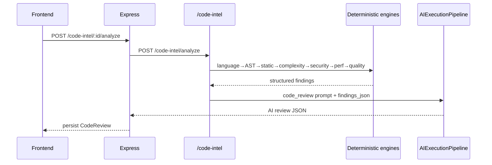

# Code Intelligence Platform (Part 7)

Deterministic analysis **before** AI. AI explains, prioritizes, and improves — it does not invent unused-variable or cyclomatic metrics.

## Pipeline

```
Upload / Paste
  → Language Detection (confidence)
  → Parser (Tree-sitter if available, else heuristic)
  → Static Analysis
  → Complexity Engine
  → Security Engine
  → Performance Engine
  → Quality Scoring
  → Prompt Builder (structured findings JSON)
  → AIExecutionPipeline
  → Structured JSON
  → Dashboard
```

## Sequence — Analyze



## Prompt registry (canonical)

| Prompt | Role |
|--------|------|
| `code_review` | Overall AI review of findings |
| `security_review` | Security explanation |
| `performance_review` | Performance explanation |
| `refactor` | Refactor proposal |
| `diff_review` | Diff explanation |
| `chat` | Code chat |
| `code_interview` | Interview coach |

AI receives `findings_json` (metrics + findings). Raw code is omitted for review/interview; refactor gets a capped supplemental excerpt + `original_code`.


`POST /code-intel/analyze/stream` emits:

1. `event: analysis` — full deterministic payload  
2. Pipeline SSE tokens (`token` / `done`) via existing `AIExecutionPipeline.stream`

Express proxies at `POST /api/v1/code-intel/:id/stream`.

## AST architecture

- Prefer Tree-sitter via optional `tree_sitter_languages`
- Fallback heuristic extracts functions, classes, imports, variables, loops, recursion, comments, call-graph edges

## Static / security / performance

Rule engines in:

- `app/code_intel/static.py`
- `app/code_intel/complexity.py`
- `app/code_intel/security.py`
- `app/code_intel/performance.py`
- `app/code_intel/quality.py`
- `app/code_intel/diff.py`

## APIs (Express `/api/v1/code-intel` — also aliased `/code-review`)

| Method | Path | Purpose |
|--------|------|---------|
| GET | `/` | List reviews (paginated) |
| POST | `/` | Create review shell |
| POST | `/upload` | File/zip upload + async analyze |
| GET | `/:id` | Get review |
| DELETE | `/:id` | Delete |
| POST | `/:id/analyze` | Full analyze |
| POST | `/:id/analyze/async` | Background analyze |
| POST | `/:id/stream` | SSE review stream |
| POST | `/:id/complexity` | Complexity only |
| POST | `/:id/security` | Security only |
| POST | `/:id/performance` | Performance only |
| POST | `/:id/refactor` | Refactor via pipeline |
| POST | `/:id/interview` | Interview coach |
| POST | `/:id/diff` | Diff review |
| POST | `/:id/chat` | Code chat (reuses chatService) |
| GET | `/analytics` | Charts data |

AI service prefix: `/code-intel/*`

## Schema

**CodeReview**: userId, title, sourceType, language, code, oldCode, status, deterministic, aiReview, refactor, interviewCoach, diffResult, qualityScore, securityScore, cyclomatic, fileStats[], reviewHistory[], conversationId

## Frontend

`/code-review` list + editor → `/code-review/:id?tab=` editor | metrics | security | performance | diff | chat | history | analytics

## Security

JWT, ownership, upload allowlist, `codeIntelLimiter`, GitHub raw URL allowlist only.

## Out of scope

GitHub Repository Analyzer, Resume, Interview Agent product, DSA Tutor, Deployment.
