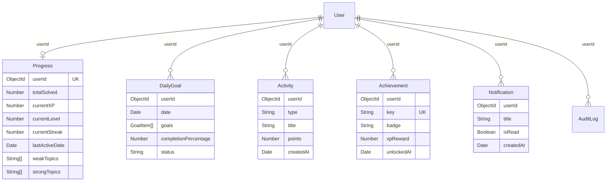

# CodeMentor AI — Dashboard & Progress System

Production SaaS dashboard layer (no AI). Integrates with existing JWT auth.

---

## 1. Updated folder tree (new / changed)

```text
backend/src/
├── models/
│   ├── Progress.model.js
│   ├── DailyGoal.model.js
│   ├── Activity.model.js
│   ├── Achievement.model.js
│   ├── Notification.model.js
│   └── AuditLog.model.js
├── services/
│   ├── dashboard.service.js
│   ├── progress.service.js
│   ├── goal.service.js
│   ├── activity.service.js
│   ├── achievement.service.js
│   ├── notification.service.js
│   ├── analytics.service.js
│   └── audit.service.js
├── controllers/
│   ├── dashboard.controller.js
│   ├── progress.controller.js
│   ├── goal.controller.js
│   ├── activity.controller.js
│   ├── achievement.controller.js
│   ├── notification.controller.js
│   └── analytics.controller.js
├── routes/
│   ├── goal.routes.js
│   ├── activity.routes.js
│   ├── achievement.routes.js
│   ├── notification.routes.js
│   └── analytics.routes.js
├── validators/dashboard.validator.js
├── utils/level.js
└── scripts/seed-dashboard.js

frontend/src/
├── context/ThemeContext.jsx
├── components/layout/Navbar.jsx
├── components/ErrorBoundary.jsx
├── components/ui/states.jsx
├── hooks/useDashboard.js          # all dashboard React Query hooks
├── pages/
│   ├── DashboardPage.jsx
│   ├── ProgressPage.jsx
│   ├── GoalsPage.jsx
│   ├── ActivityPage.jsx
│   ├── AchievementsPage.jsx
│   ├── AnalyticsPage.jsx
│   └── GithubReviewPage.jsx
└── docs/DASHBOARD.md
```

---

## 2. Database schema diagrams



**Indexes:** `userId`, `createdAt`, `date`, `lastActiveDate`, plus compounds  
`(userId, date)`, `(userId, createdAt)`, `(userId, type, createdAt)`, `(userId, isRead, createdAt)`.

**Source of truth:** Progress = streak/XP/scores; DailyGoal = goals; User.streak/currentGoal kept only for backward compatibility.

---

## 3. API documentation

Base: `/api/v1` · Auth: Bearer access token · Response shape:

```json
{ "success": true, "message": "", "data": {}, "meta": {} }
```

| Method | Path | Description |
|--------|------|-------------|
| GET | `/dashboard` | Aggregate streak, XP, today's goals, stats, activity, achievements, topics |
| GET | `/progress` | Current progress document |
| PATCH | `/progress` | Update scores / solved counts / XP / topics |
| POST | `/goals` | Create goal item (today or date) |
| GET | `/goals` | List daily goals |
| PATCH | `/goals/:id` | Update goal item (`completed`, title, priority) |
| DELETE | `/goals/:id` | Soft delete (`isDeleted=true`) |
| GET | `/activity` | Paginated activity (`page,limit,type,startDate,endDate,sort`) |
| GET | `/achievements` | Unlocked + catalog; auto-evaluates unlocks |
| GET | `/notifications` | List notifications |
| PATCH | `/notifications/:id/read` | Mark read |
| GET | `/analytics` | Chart series for Recharts |

---

## 4. Component hierarchy

```text
App
 └ ThemeProvider
   └ AuthProvider
     └ AppLayout
        ├ Sidebar (nav + logout)
        ├ Navbar (search, theme, notifications, avatar)
        └ Outlet
           ├ DashboardPage → StatCard, Cards, Empty/Error
           ├ ProgressPage → scores form (optimistic)
           ├ GoalsPage → create/update/delete (optimistic)
           ├ ActivityPage → infinite scroll list
           ├ AchievementsPage → unlocked/locked grids
           └ AnalyticsPage → Recharts charts
```

---

## 5. Route hierarchy

```text
/login, /register, /forgot-password     (GuestRoute)
/dashboard                              (Protected)
/progress
/goals
/activity
/achievements
/analytics
/resume, /code-review, /interview, /github, /planner, /chat  (Coming Soon shells)
/profile, /settings
*
```

---

## 6. State management flow

```text
AuthContext → currentUser, login/logout/register
ThemeContext → light | dark | system (localStorage)
React Query → server state (dashboard, progress, goals, activity, achievements, notifications, analytics)
Optimistic updates → Progress PATCH, Goal complete/delete
```

---

## 7. React Query flow

```text
useDashboard()        → GET /dashboard
useProgress()         → GET /progress
useUpdateProgress()   → PATCH /progress (+ optimistic)
useGoals()            → GET /goals
useCreateGoal()       → POST /goals
useUpdateGoal()       → PATCH /goals/:id (+ optimistic)
useDeleteGoal()       → DELETE /goals/:id (+ optimistic)
useActivity()         → infinite GET /activity
useAchievements()     → GET /achievements
useNotifications()    → GET /notifications (dummy fallback)
useAnalytics()        → GET /analytics
```

Invalidation cascades: goal/progress mutations → dashboard + activity + progress keys.

---

## 8. Folder explanation

| Folder | Purpose |
|--------|---------|
| `models/` | Mongoose schemas + indexes only |
| `services/` | Business logic, XP, unlocks, soft delete |
| `controllers/` | Thin HTTP adapters |
| `validators/` | Zod request contracts |
| `utils/level.js` | Reusable gamification math |
| `hooks/useDashboard.js` | All dashboard React Query hooks |
| `context/ThemeContext.jsx` | Theme persistence |
| `components/ui/states.jsx` | Empty / error / stat cards |

---

## 9. Future scalability improvements

1. Redis cache for dashboard aggregate
2. Materialized daily analytics collection
3. WebSocket push for notifications
4. Partition Activity by month
5. Remove legacy `User.streak` / `User.currentGoal`
6. CQRS read models for Analytics
7. Feature flags per SaaS plan

---

## Run / seed

```powershell
# Backend
cd backend
npm install
npm run seed:dashboard   # requires MongoDB
npm run test
npm run dev

# Frontend
cd frontend
npm install
npm run dev
```

Demo user after seed: `demo@codementor.ai` / `DemoPass1!`
