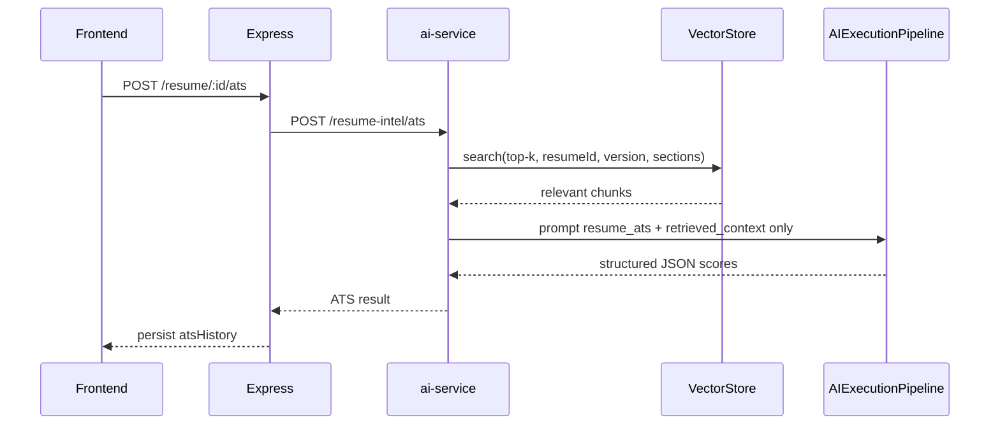
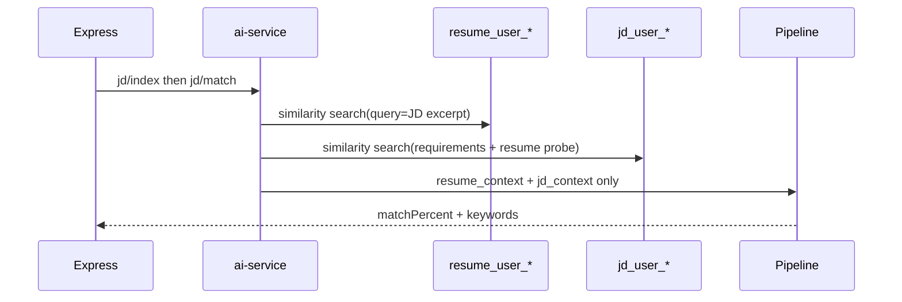

# Resume Intelligence Platform (Part 6)

CodeMentor AI Resume Intelligence is a **knowledge-base + RAG** product on top of the Part 4 AI infrastructure — not a one-shot “upload PDF → ATS score” tool.

## Sequence — ATS (RAG)



## Sequence — JD match



## Pipeline flow


```
Upload (Express)
  → Document Loader / text extract
  → Hybrid Resume Parser + Section Detection (confidence)
  → Section/bullet semantic Chunking
  → EmbeddingFactory (vectors persisted in VectorStore)
  → VectorStoreService `resume_user_{userId}` / `jd_user_{userId}`
  → ResumeRetriever (top-k, threshold, resumeId/version/section filters)
  → AIExecutionPipeline (Prompt Registry + Memory + Middleware + Telemetry)
  → Structured JSON
  → Dashboard
```

**RAG rule:** ATS, bullets, skills, JD match, report, compare, and chat send **retrieved chunks only** — never the full structured resume dump to the LLM.

## Re-index / rollback

- Re-index: delete previous `chunkIds`, re-embed, store new vectors  
- Rollback: `POST /:id/rollback` sets `currentVersion` to an existing version (history retained)  
- Compare: retrieves chunks for version_a and version_b, then structured JSON via pipeline  

## Chunk metadata

`resumeId`, `version`, `section`, `page`, `chunkId`, `createdAt`, `embeddingModel`

## Architecture

| Layer | Responsibility |
|-------|----------------|
| Frontend | Resume hub: dashboard, sections, KB search, ATS, JD match, chat, analytics |
| Express | JWT ownership, multer validation, versioning, async index orchestration, CRUD |
| ai-service `/resume-intel` | Parse, index, RAG, ATS, bullets, skills, JD, report, compare |

### Reused infrastructure

- `AIExecutionPipeline`, middleware, telemetry, streaming (chat reuse)
- `ProviderFactory`, `EmbeddingFactory`, `PromptRegistry`, `MemoryFactory`
- `DocumentLoader` / `LOADERS`, `VectorStoreService`
- DI via `app/core/deps.py`
- Copilot `chatService` for resume-tied conversations

## Collections

- Resume KB: `resume_user_{userId}`
- Job descriptions: `jd_user_{userId}`

Chunk metadata: `resumeId`, `version`, `section`, `page`, `chunkId`, `embeddingModel`, `embeddingCreatedAt`.

## Hybrid parsing

1. Line split + heading alias table + confidence scores  
2. Unknown / weak ALL-CAPS → `miscellaneous`  
3. Supplemental contact/URL patterns (not the only strategy)  
4. Optional LLM enrichment remains available via pipeline prompts (ATS / report)

## Chunking strategy

- Sections: summary, skills, experience, projects, education, achievements, certifications, publications, languages, miscellaneous  
- Experience / projects / achievements: bullet-aware units, then `split_text`  
- Others: whole section then split  

## ATS strategy

Prompt `resume_ats` + retrieved context → JSON:

- Overall score  
- Section scores: formatting, keywordMatch, readability, impact, actionVerbs, quantification, consistency, structure  

## JD matching

1. Index JD into `jd_user_*`  
2. Retrieve resume + JD contexts  
3. Pipeline prompt `resume_jd_match` → match %, keywords, skills, improvements  

## Resume chat

- Conversation created with `systemPrompt: resume_chat`  
- RAG hits injected via `systemPromptOverride`  
- Messages sent through existing `chatService` → `/chat` pipeline  

## Security

- JWT on all `/api/v1/resume*` (global auth)  
- Ownership checks (`userId` on Resume / JD)  
- Upload MIME + size + virus **placeholder**  
- `resumeLimiter` (30 req/min)  

## Performance

- Async background indexing after upload / new version  
- Frontend polls `indexStatus`  
- Pagination on resume list  
- Lazy tab loading for analytics / JD list  

## API (Express `/api/v1/resume`)

| Method | Path | Purpose |
|--------|------|---------|
| GET | `/` | List resumes |
| POST | `/upload` | Upload (multipart `file`) |
| GET | `/:id` | Get resume + versions |
| PATCH | `/:id` | Update meta |
| DELETE | `/:id` | Delete + chunk cleanup |
| POST | `/:id/versions` | New version |
| POST | `/:id/reindex` | Re-index |
| POST | `/:id/search` | RAG search |
| POST | `/:id/ats` | ATS eval |
| POST | `/:id/bullets` | Bullet improvements |
| POST | `/:id/skills` | Skill gap |
| POST | `/:id/report` | Reports (json/markdown) |
| POST | `/:id/compare` | Version compare |
| GET/POST | `/jd` | List / create JD |
| POST | `/:id/jd/:jdId/match` | Match |
| POST | `/:id/chat` | Resume chat |
| GET | `/:id/analytics` | Charts data |

## AI service (`/resume-intel`)

`parse-index`, `search`, `ats`, `bullets`, `skills`, `jd/index`, `jd/match`, `report`, `compare`, `chunks/delete`

## Schema (Mongo)

**Resume**: `userId`, `title`, `targetRole`, `currentVersion`, `versions[]` (file meta, structured, chunkIds, ats/bullets/skills/report, indexStatus), `conversationId`, `atsHistory`, `status`

**JobDescription**: `userId`, `resumeId`, `title`, `company`, `text`, `indexed`, `lastMatch`

## Frontend hierarchy

```
/resume                     → list + upload
/resume/:id?tab=overview    → dashboard
         ?tab=sections      → section viewer
         ?tab=knowledge     → chunk / KB search
         ?tab=ats           → ATS + bullets + skills + report
         ?tab=jd            → JD matching
         ?tab=chat          → resume chat
         ?tab=analytics     → ATS history / skill growth
```

## Backend hierarchy

```
models/Resume.model.js
models/JobDescription.model.js
services/resume.service.js
services/aiClient.service.js   (+ resume* methods)
controllers/resume.controller.js
routes/resume.routes.js
validators/resume.validator.js
config/multer.js               (uploadResume)
```

## AI hierarchy

```
app/resume/parser.py
app/resume/chunker.py
app/resume/rag.py
app/resume/service.py
app/routers/resume_intel.py
app/prompts/registry/resume_*.yaml
```

## Testing

```bash
cd ai-service
pytest tests/test_resume_intel.py tests/test_infra.py -q
```

## Remaining TODOs

- Native PDF report export (markdown/json shipped)  
- Deeper LLM-assisted section classification pass (hybrid heuristics shipped)  
- Optimistic UI for ATS/JD mutations beyond index polling  
- Dedicated compare tab UI (API exists)  
- Virus scanner integration beyond placeholder  
